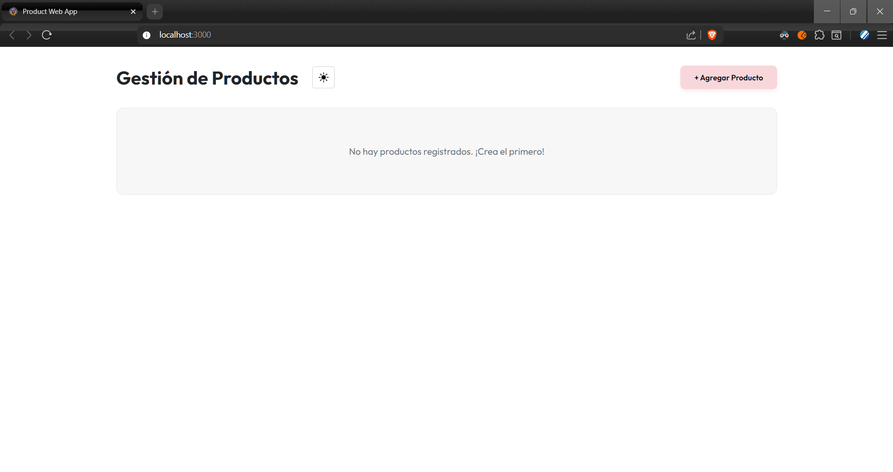
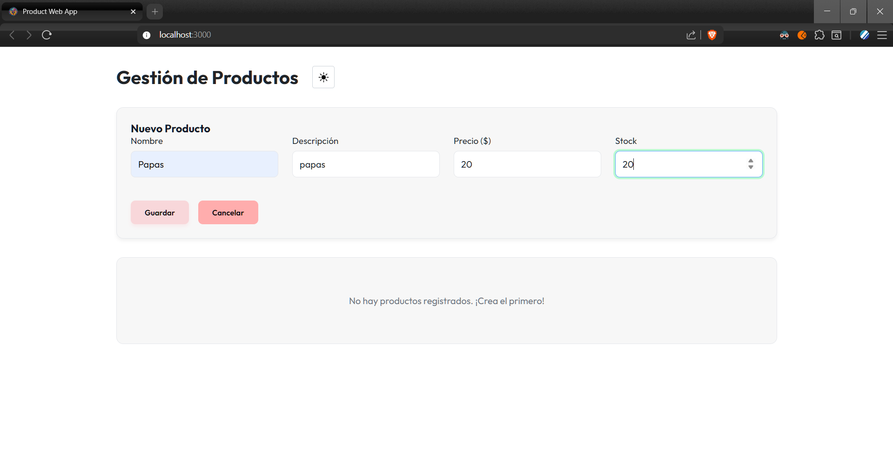
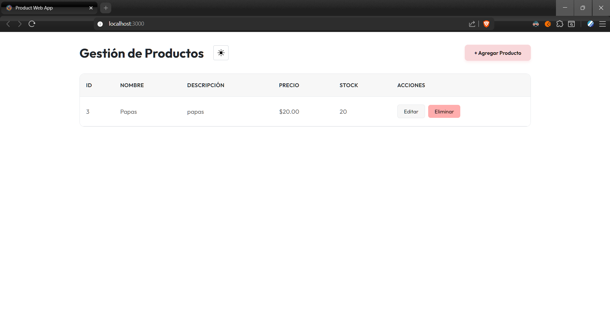
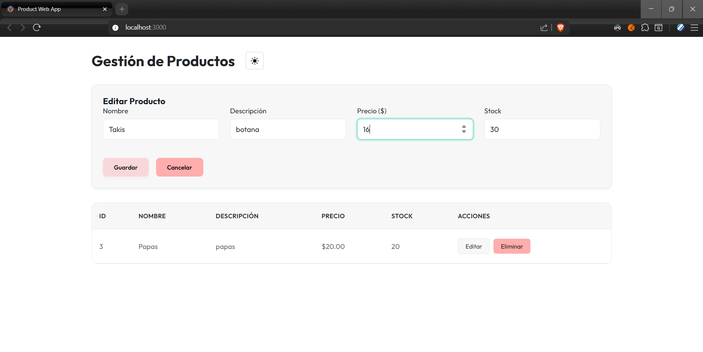
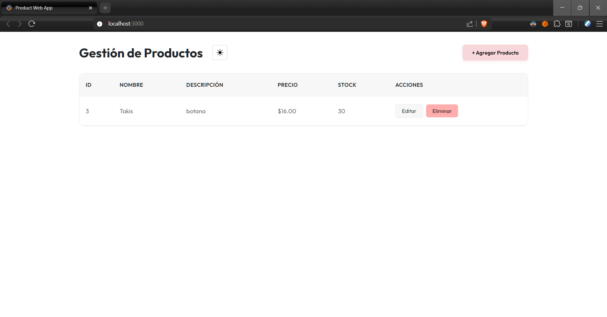
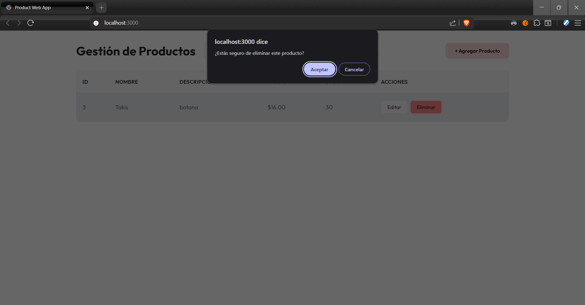
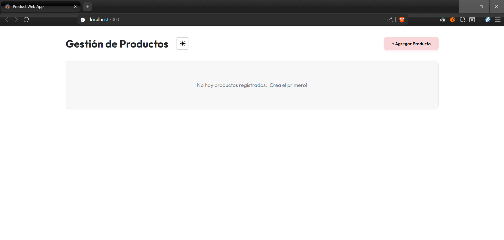

# Product Service

Este es el microservicio encargado de la gestión, administración y persistencia de productos para la plataforma **Product Web App**. Construido con un enfoque modular, robusto y escalable siguiendo los principios **SOLID**.

## 🚀 Tecnologías Utilizadas

El proyecto hace uso de un stack tecnológico de vanguardia para asegurar el mejor rendimiento:

*   **Framework:** [NestJS 11](https://nestjs.com/) (Node.js)
*   **Lenguaje:** [TypeScript](https://www.typescriptlang.org/)
*   **Base de Datos:** [MySQL](https://www.mysql.com/) con [TypeORM](https://typeorm.io/)
*   **Documentación:** [Swagger / OpenAPI](https://swagger.io/)
*   **Logging:** Pino Logger para trazabilidad de alto rendimiento.

## 🛠️ Funcionalidades Principales

*   **Gestión de Inventario (CRUD):** Creación, lectura, actualización y eliminación de productos con persistencia en MySQL.
*   **Validación de Datos:** Reglas de negocio estrictas para la entrada de datos mediante DTOs.
*   **Documentación Interactiva:** Endpoint `/api` para visualizar y probar la API en tiempo real.
*   **Manejo Global de Errores:** Respuestas estandarizadas y seguras para el cliente.
*   **Logging en Tiempo Real:** Interceptores que registran cada petición y respuesta para auditoría.

## 📦 Instrucciones para Ejecutar el Proyecto

Sigue estos pasos para poner en marcha el servicio localmente:

1.  **Clonar el repositorio:**
    

```bash
    git clone https://github.com/AlanAguil/service-product
    cd service-product
```

2.  **Instalar dependencias:**
    

```bash
    npm install
```

> **Antes de iniciar el servicio:** Debes asegurarte de tener instalada una instancia de **MySQL** y haber creado manualmente la base de datos especificada en el archivo `.env` (por defecto: `product_db` ). Si la base de datos no existe, el servicio **no levantará** debido a que TypeORM intentará conectarse a ella inmediatamente.

3.  **Configurar variables de entorno:**
    Crea un archivo `.env` en la raíz siguiendo el ejemplo de las credenciales de tu base de datos:
    

```env
# Ambiente
NODE_ENV=development

# Base de datos
DB_HOST=localhost
DB_PORT=3306
DB_DATABASE=product_db
DB_USERNAME=root
DB_PASSWORD=alan2004

# App
APP_PORT=4002
```

4.  **Iniciar en modo desarrollo:**
    

```bash
    npm run start:dev
```

5.  **Acceder a la documentación:**
    Visita `http://localhost:4002/docs` (o el puerto configurado) para ver la interfaz de Swagger.

## 💻 Ejecución del Frontend (Web App)

Para levantar la interfaz de usuario, sigue estos pasos:

1.  **Clonar el repositorio:**
    

```bash
    git clone https://github.com/AlanAguil/product-web-app
    cd product-web-app
```

2.  **Instalar dependencias:**
    

```bash
    npm install
```

3.  **Configurar variables de entorno:**
    Crea un archivo `.env` en la raíz siguiendo el ejemplo de las credenciales de tu base de datos:
    

```env
    VITE_API_URL=http://localhost:4002/api
```

5.  **Iniciar en modo desarrollo:**
    

```bash
    npm run dev
```

6.  **Acceder a la aplicación:**
    La aplicación estará disponible en `http://localhost:3000` (puerto por defecto de Vite).

## 📸 Evidencias









## 🤖 Uso de Inteligencia Artificial

Este proyecto ha sido desarrollado con el apoyo de **Antigravity** de Google para las siguientes tareas:
*   **Análisis Arquitectónico:** Definición de la estructura modular y aplicación de principios SOLID.
*   **Optimización de Código:** Refactorización de servicios y controladores para mejorar la legibilidad.
*   **Generación de Documentación:** Creación de este README.

---
